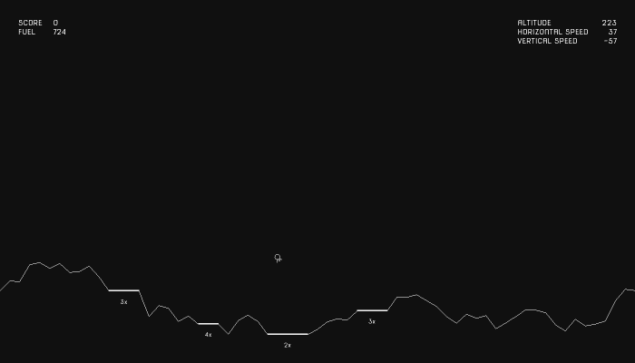

# Lunar-Lander-Culebra

[aayala4/Lunar-Lander-Python](https://github.com/aayala4/Lunar-Lander-Python)
ported to [Culebra](https://github.com/yhirose/culebra).

[](https://yhirose.github.io/Lunar-Lander-Culebra/)

The original is a Lunar Lander written for a Fundamentals of Computing course,
running on pgzero (Pygame Zero). This port keeps its 1400x800 playfield, its
physics constants, its midpoint-displacement terrain and its scoring, and
replaces pgzero with Culebra's `Canvas`, so it opens a real window on macOS,
Linux and Windows. [Play it in the browser](https://yhirose.github.io/Lunar-Lander-Culebra/).

## Running

Culebra 0.4.0 or later, built with the Canvas window backend (the default on
macOS).

```bash
culebra lunar_lander.cul       # play
culebra --jit lunar_lander.cul # the same, JIT-compiled
```

P starts a round. Left and Right rotate the hull, Up and Down work the
throttle, Q returns to the title screen, Esc quits. The hull spawns pointing
sideways, so the first thing to do is rotate it upright.

D hands the controls to the autopilot, and D again takes them back, at any
point in a round; pressed on the title screen it starts a round the autopilot
is already flying. `DEMO` sits at the top of the HUD for as long as it has
them, and it flies the same way the headless run below does: it picks a pad,
crosses to it, and lands on it level, which over 80 seeds it does every time.

Put both feet down under 12 units of vertical speed and 25 of horizontal for a
good landing, worth 50 points and 50 units of fuel back. The flattened pads
marked `2x` through `5x` multiply the score, and the narrower the pad the more
it pays. Come in faster and it is a hard landing or a crash, and a crash costs
100 fuel. When the tank empties, the game is over.

Headless autopilot, for a regression check or a machine with no display. It
flies a fixed seed -- picking a landing pad, crossing to it and setting down
on it -- and writes `shot.png` of its last frame:

```bash
CULEBRA_CANVAS_HEADLESS=1 culebra lunar_lander.cul demo 1400
# => score 250, fuel 652 after 1400 frames
```

Tests:

```bash
CULEBRA_CANVAS_HEADLESS=1 culebra test
```

## In the browser

<https://yhirose.github.io/Lunar-Lander-Culebra/> runs the same three `.cul`
files as WebAssembly, through culebra's own Playground. The ~4.4 MB interpreter
starts loading on arrival, with a still frame of the title screen over the
frame until the game is drawing. Press P to start, or click the game. A
vim-style browser extension binds the letter keys and can swallow P before the
page sees it, and a click is a way in that no extension takes.

`docs/` is what GitHub Pages serves. The Playground under it is vendored from
culebra's built site and changes only when it is re-vendored, along with the
`docs/assets/brand.css` its page loads from outside that tree; the copy of the
game beside it is generated, so it cannot go stale against the source at the
repository root:

```bash
culebra tools/sync-docs.cul          # refresh the copy
culebra tools/sync-docs.cul --check  # exit 1 if it is stale, write nothing
```

`docs/playground/examples.json` names each file once and both the copy and the
check are driven off that list.

## Layout

| File | Contents |
| --- | --- |
| `lunar_lander.cul` | the game: states, physics, HUD, frame loop, demo autopilot |
| `ship.cul` | the lander: hull, legs, throttle, fuel, hitbox, collision verdict |
| `terrain.cul` | midpoint-displacement ground, landing pads and their multipliers |
| `test_lander.cul` | checks on terrain generation, the pads, and each collision verdict |
| `assets/` | the original's two sound effects, and the font that stands in for its own |
| `tools/sync-docs.cul` | mirrors the game into `docs/` for GitHub Pages |
| `docs/` | the Pages site: the landing page, and the vendored Playground that runs the game |

## What changed

| The original | Here |
| --- | --- |
| pgzero's `draw()` / `update(dt)` pair | one `Canvas.run` tick, with the real frame time replaced by a fixed 1/60 s |
| `clock.schedule(...)` for the pauses between lives | a frame deadline, since the loop runs at vsync |
| `keyboard.left` and friends | `Canvas.key("left")`, polled the same way, except that starting a round and leaving one read `Canvas.key_queue()` (see below) |
| the `dylova` TTF, which the player had to download separately | Nova Square, which ships in `assets/`: dylova is freeware its designer does not license for redistribution, and this is the closest OFL face |
| `sounds.rocket_thrust.play(-1)` | the looping `Canvas.music` slot, put in step with the throttle once a frame |
| scanning every terrain point for every hitbox point | the same test against a topmost-ground-per-column lookup |

That last row is the only one that changes the shape of the code rather than
the API it calls. The original compares each of the ship's 38 hitbox points
against all ~1400 terrain points every frame. Only the highest terrain point in
a column can ever decide the test, so `terrain.cul` keeps one array of those
and `ship.cul` reads three columns per point. The verdict is identical, the
frame cost is not: a frame costs about 0.6 ms on the bytecode VM against a
16.7 ms budget, measured as the difference between headless `demo 2400` and
`demo 1200` wall clock (best of eight each, so interpreter startup cancels).

Two quirks of the original are kept deliberately, because they are visible in
play: the overlap check in `place_spots` indexes a pad's length by the number
of pads placed so far rather than by that pad's own length, and the HUD's
"vertical speed" reads as a rate of climb, so a descent shows negative.

Rotating and working the throttle repeat for as long as the key is down, so
they poll `Canvas.key`, exactly as the original polls `keyboard.left`. Starting
a round and leaving one happen once per press, and a press is not a state: tap
P where a frame takes longer than the tap, as it can in a browser, and both the
press and the release fall between two polls, so nothing ever saw the key down.
Those two read `Canvas.key_queue()`, which keeps the press until it is read.

Sound is the explosion as a one-shot `Canvas.Sound` and the rocket thrust
looping through the single `Canvas.music` slot. Both are silent in a headless
run.

## License

GPL-3.0, the same as the original, and it has to be. This is a derivative work
of GPL-3.0 sources, and it ships the original's two `.ogg` files, so the port
as a whole carries the same license. `LICENSE` is the GPLv3 text taken from the
original repository.

The original game is Copyright (C) aayala4.

`assets/NovaSquare.ttf` is Nova Square by Wojciech Kalinowski, under the SIL
Open Font License 1.1 (`assets/NovaSquare-OFL.txt`), which allows it to be
bundled with software under any licence. It stands in for the `dylova` TTF the
original asked the player to fetch from fontspace: that one is freeware whose
designer asks to be contacted for commercial use, with no grant to
redistribute, so it cannot ride along in a repository that anyone may fork.

`docs/playground/` holds a copy of [culebra](https://github.com/yhirose/culebra)'s
Playground build (the two `.wasm` files and the page around them, plus
`docs/assets/brand.css`), which is MIT and stays MIT. It is an interpreter
that runs this program, not a part of it, and MIT is GPL-compatible either
way. The game beside it, under `docs/playground/lunar-lander/`, is the
generated copy of the GPL-3.0 sources at the repository root and carries their
license.
